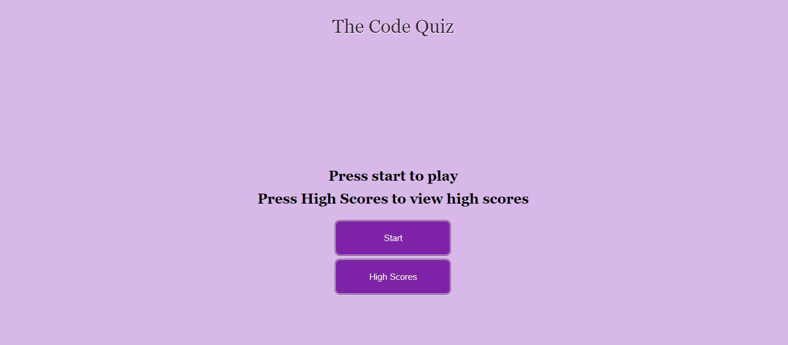
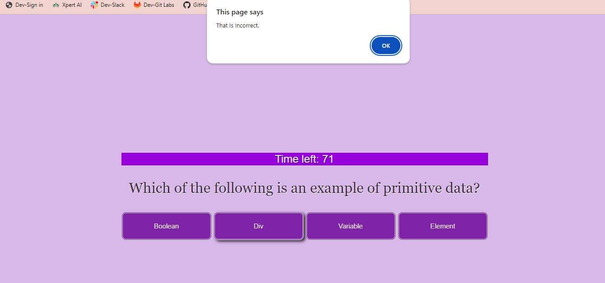

# The Code Quiz

## Description

This program was developed to quiz knowledge of HTML, CSS, and Javascript.
The program will log score and time and will allow you to log your 
initials upon completion of the quiz.

## Installation

No installation necessary!

## Usage

    To use the application:
    -Press the start button
    -Complete a selection of questions
    -Log your highscore with your initials

## Link to website!
https://kalleepar.github.io/The_Code_Quiz/

## Credits

- Kal Parker
- Special Thanks to MDN and W3schools

## License

MIT LICENSE